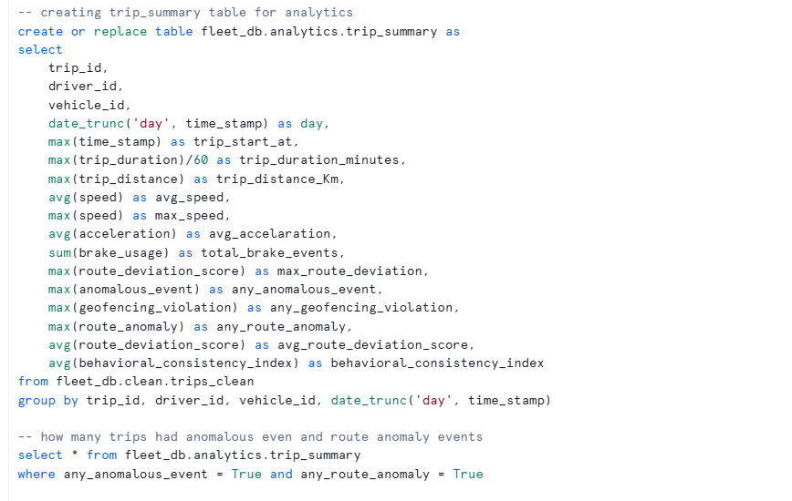
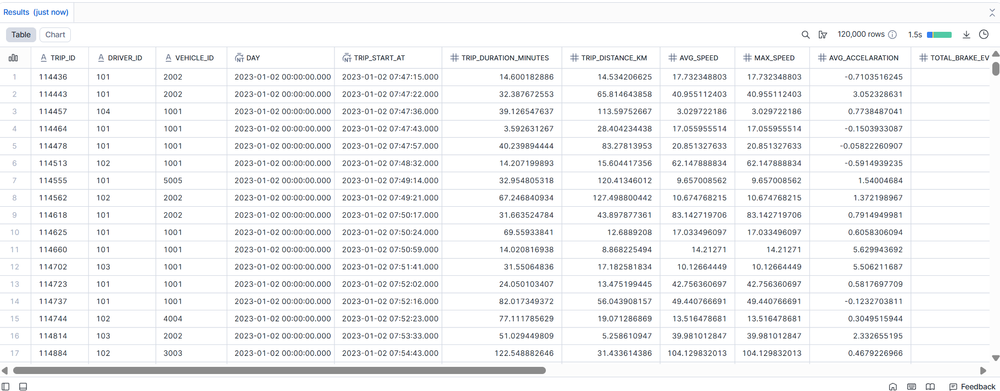
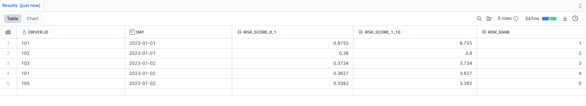
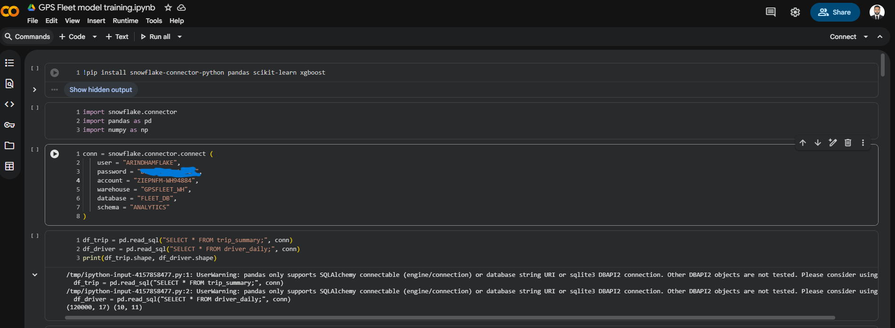
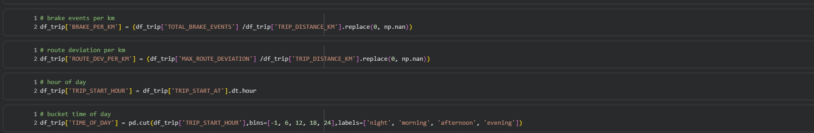
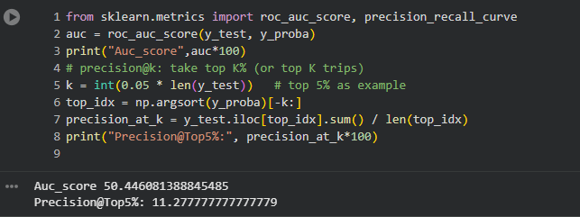
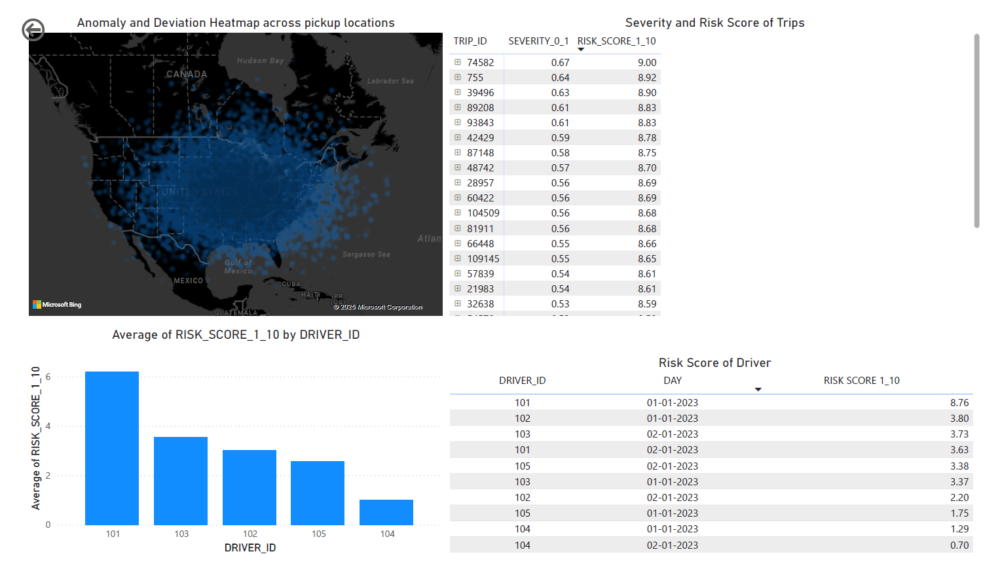
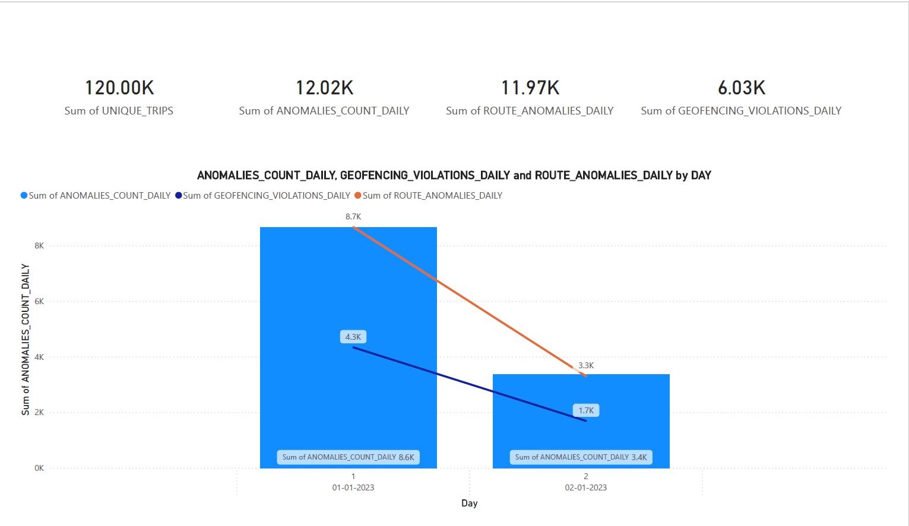
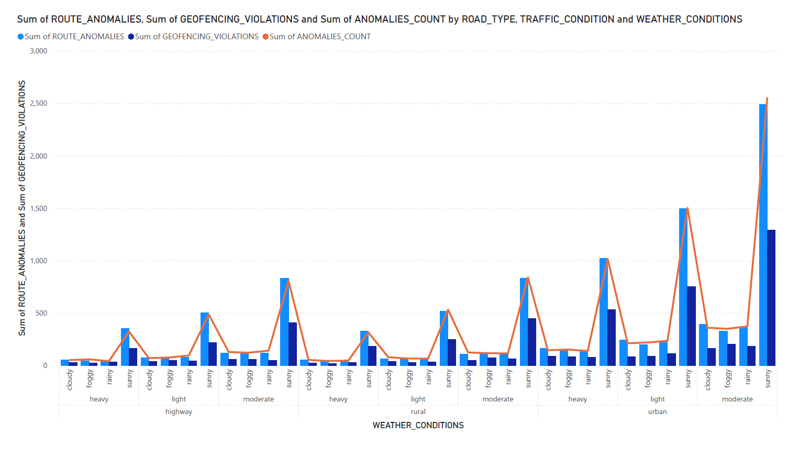
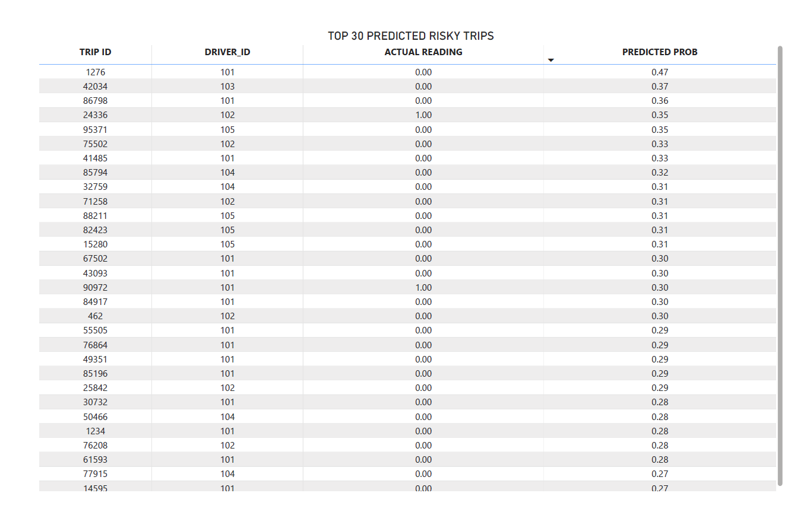

**Originally developed by Arindham Krishna**  
GitHub: [arindham-codes-cmd](https://github.com/arindham-codes-cmd)

# Fleet-Risk-Driver-Behavior-and-Route-Anomaly-Detection
This project analyzes large scale GPS telematics data to evaluate driver behavior, compute risk scores, and detect route anomalies across real world fleet trips. The end-to-end pipeline integrates Snowflake SQL, Python based machine learning, and Power BI visualization to provide actionable fleet insights.

# Project Overview
- This dataset consists of 120,000+ trip records, each containing 26 behavioral, environmental, and route specific attributes.
- We built a structured Snowflake warehouse, performed multi layered data transformations, engineered trip-level and driver-level metrics, generated SQL based risk scores for drivers, and trained an ML model to predict risky trips.
- The results were visualized through a Power BI dashboard highlighting driver risk ranking, anomaly distribution, and ML predictions.

This project demonstrates a practical, production-style workflow that mirrors how modern fleet safety and telematics systems operate.
# Business Problem
**“Identify risky driver behavior and detect route anomalies in order to improve fleet safety, reduce operational incidents, and support proactive intervention.”**
The Fleet companies rely on consistent and safe driving. Micro-behaviors and hard braking, unstable steering, route deviations, geofencing violations all scale into safety risks and operational inefficiencies. With timestamped GPS telemetry and behavioral metrics, we can quantify risk, rank drivers, highlight anomalies, and predict unsafe trips before they escalate.

# Project Blueprint
## Phase A–I: Snowflake Ingestion, Cleaning & Transformations

We created a multi-schema Snowflake warehouse:
RAW → CLEAN → ANALYTICS

Key transformations included:
- Cleaning timestamps, coordinates, and categorical values
- Converting trip metrics from raw format
- Aggregating trip summary metrics
- Daily driver rollups
- Creating a structured analytics layer used for ML and BI
  

 



### Driver Risk Score (SQL Computation)

We engineered a Driver Risk Score using normalized daily metrics such as:
- anomalies_count_daily
- route_anomalies_daily
- geofencing_violations_daily
- avg_route_deviation_daily
- behavioral_consistency_index_daily (inverted, lower consistency → higher risk)

We normalized each metric using min-max scaling and applied weighted scoring:
- 35% → inverse behavioral consistency
- 30% → geofencing violations
- 20% → anomaly count
- 10% → route anomalies
- 5% → route deviation

The SQL logic (for the top 5 risky drivers) can be added as:
```
-- Top 5 risky drivers with weighted risk score
WITH stats AS (...), norm AS (...), scored AS (...)
SELECT *
FROM scored
WHERE risk_rank <= 5
ORDER BY risk_rank;
```


### Why we used Staging instead of Direct Upload

Staging ensures:
1. A permanent copy of the raw dataset for auditability.
2. Controlled ingestion with format options, headers, delimiters.
3. Schema consistency and repeatability for future reloads.
4. Separation between raw input and cleaned analytics layers.
This aligns with industry grade data engineering practices.

## Phase J: Machine Learning (Python / Colab)

We connected to Snowflake through a Python connector and imported:
- trip_summary (120k rows × 17 columns)
- driver_daily (10 rows × 17 columns)
Due to limited driver-level observations, ML was focused on trip-level risk prediction, not driver risk prediction.



Feature Engineering Included
- brake events per km
- route deviation per km
- hour of day
- time-of-day bucket



### Model Performance
```
AUC Score: ~50.44%
Precision@Top5%: ~11.27%
```


Interpretation:
- AUC near 50% shows limited separability but is expected with sparse anomaly labels.
- Precision@Top5% indicates that among the top 5% most risky predicted trips, ~11% were actual anomalies — useful for operational triage lists.
- Since anomaly occurrences are extremely rare, even modest lift over random selection has value in safety operations.

## Phase J (BI Layer): Power BI Insights

Power BI contains:
- A heatmap of anomaly and deviation density across the US and California.
- Average Risk Score by Driver
- Driver-wise daily risk history
- Route anomaly and geofencing distributions by weather, traffic, and road type
- Top predicted risky trips (ML inference)







# Did We Meet the Business Problem?
Yes, We successfully:
- Quantified driver behavior using SQL-based risk scoring
- Identified high-risk drivers with consistent indicators of unsafe patterns
- Summarized daily anomalies, geofencing violations, and route deviations
- Used ML to surface potentially unsafe trips for review
- Built BI dashboards for operational monitoring
- Enabled proactive visibility into driving inconsistencies and route-level issues

While the ML model performance is modest due to rare anomaly labels, the full analytics pipeline is reproducible, scalable, and ready for richer datasets. The SQL-based risk score proved highly interpretable and operationally valuable.

## Credits

This project was originally created and maintained by **Arindham Krishna**.  
All analysis, SQL engineering, ML modeling, and BI reporting were authored by [arindham-codes-cmd](https://github.com/arindham-codes-cmd).

## Fork Notice

If you’re viewing this project from a forked repository, please note that the original version was developed by **Arindham Krishna**.  
Visit the source repo here: [Fleet-Risk-Driver-Behavior-and-Route-Anomaly-Detection](https://github.com/arindham-codes-cmd/Fleet-Risk-Driver-Behavior-and-Route-Anomaly-Detection)
